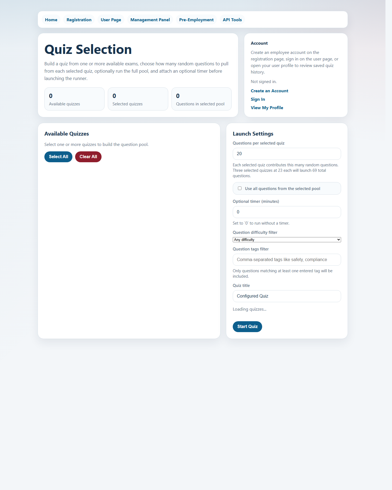
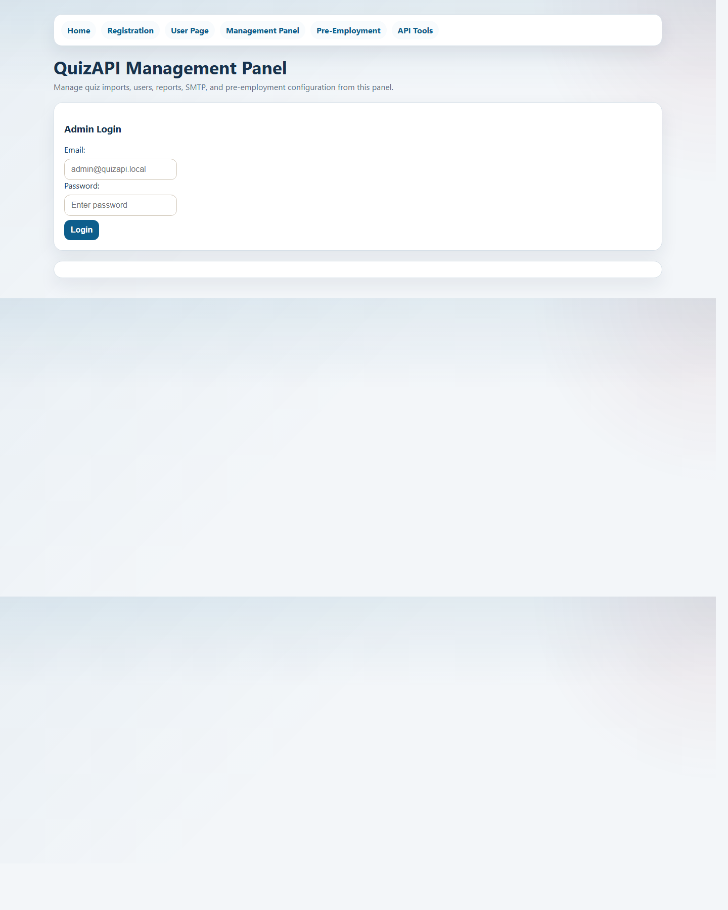

# TheCertMaster-CustomQuizs


TheCertMaster-CustomQuizs is a .NET 9 quiz platform for building, importing, managing, and delivering custom quizzes through a single ASP.NET Core application. It combines a JSON API, browser-based pages, admin tooling, question editing, custom quiz creation, reporting, and a pre-employment assessment flow in one deployable site.

## Overview

This project is the active source code for the corporate/custom-quiz version of TheCertMaster. It is designed to run as a single IIS-friendly application where the public site, user pages, admin pages, and API all live together.

It supports:

- user registration, login, profile management, and quiz history
- quiz launch, mixed quiz generation, scoring, and reporting
- quiz imports with uploaded media
- admin-side question editing with pagination
- custom quiz creation from selected questions in "Basic" quizzes
- pre-employment assessment configuration, generation, submissions, and notifications

## Screenshots

### Landing Page




### Question Editor



### Quiz Creator


## Features

- Serve the landing page from `/` and public utility pages from `wwwroot`
- Register users and authenticate with JWT-backed API flows
- Import quiz packages and uploaded images
- Edit existing questions directly from the management panel
- Build new custom quizzes from selected source questions
- Run pre-employment assessments with configurable quiz selection and question counts
- Access Swagger/OpenAPI during development

## Main Pages

- `/` for the landing page
- `/register.html` for registration
- `/user.html` for sign-in and profile access
- `/manage.html` for the management panel
- `/quiz.html` for quiz taking
- `/preemployment.html` for candidate assessments
- `/api.html` for API and developer links

## Tech Stack

- ASP.NET Core 9
- Entity Framework Core 9
- SQL Server
- ASP.NET Identity
- JWT authentication
- Swagger / OpenAPI
- Static HTML, CSS, and JavaScript under `wwwroot`

## Quick Start

### For Developers

1. Install the .NET 9 SDK.
2. Make sure SQL Server or SQL Server Express is available.
3. Configure the database connection and JWT settings.
4. Restore, build, and run the app.

```powershell
dotnet restore
dotnet build QuizAPI.sln
dotnet run
```

By default, the app runs on:

- `http://localhost:5085`
- `http://127.0.0.1:5085`

### For Reviewers or Non-Developers

If you just want to inspect the app locally:

1. Start the application with `dotnet run`.
2. Open `http://localhost:5085`.
3. Use the top navigation to move between registration, user access, management, quiz taking, and pre-employment pages.

## Configuration

The app requires:

- a SQL Server connection string
- JWT settings with a signing key of at least 32 characters

Common keys:

- `ConnectionStrings:DefaultConnection`
- `Jwt:Issuer`
- `Jwt:Audience`
- `Jwt:Key`
- `Database:AutoMigrateOnStartup`

In the current local setup:

- `appsettings.json` contains the SQL Server connection string
- `appsettings.Development.json` contains local development JWT settings and dev-only behavior

## Testing

Run the automated tests with:

```powershell
dotnet test QuizAPI.sln -c Release
```

The test suite covers key flows such as imports, mixed quiz generation, pre-employment configuration and submissions, and admin editing workflows.

## Repository Layout

```text
Controllers/        API and admin endpoints
Data/               EF Core DbContext and database access
DTO/                Request and response models
Documentation/      Usage docs and README screenshots
Middleware/         Custom middleware such as audit logging
Migrations/         EF Core migrations
Models/             Domain and persistence models
Services/           Quiz query, import, email, and config services
wwwroot/            Static pages, scripts, styles, and uploaded assets
QuizAPI.Tests/      Integration and end-to-end flow tests
```

## Important Notes

- API JSON is serialized with PascalCase.
- Development auto-migration is disabled in the current local setup to avoid schema drift against existing databases.
- Uploaded content and operational files live inside the app structure, including `wwwroot/uploads` and `App_Data`.

## Documentation

- `Documentation/Application_Usage_Guide.md`

## Project Status

This repository is actively maintained and currently serves as the main source project for the corporate/custom quiz variant of TheCertMaster.
