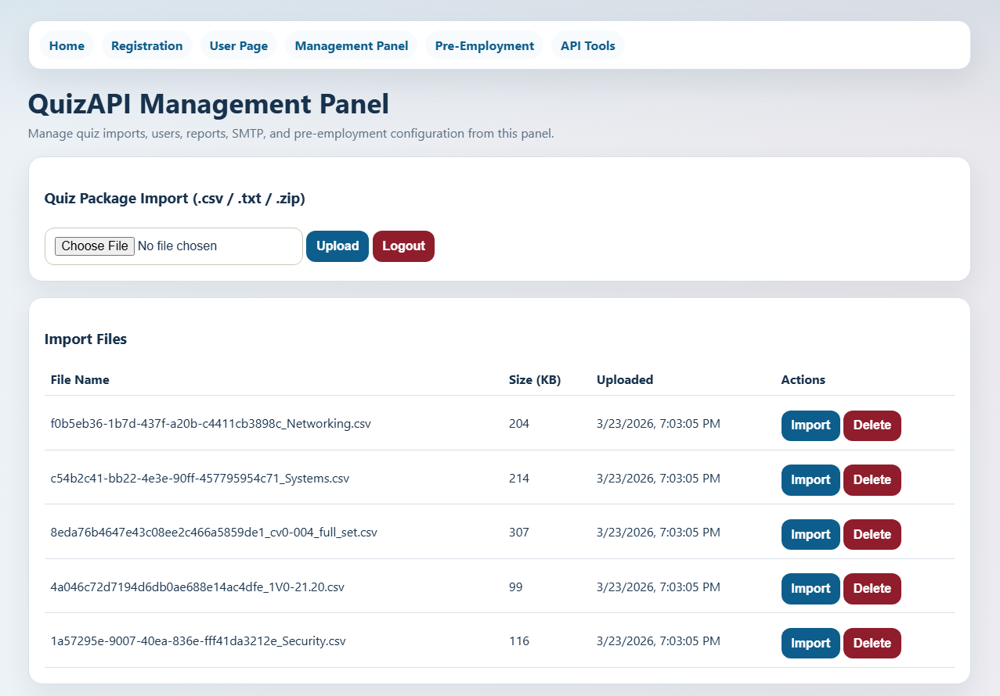
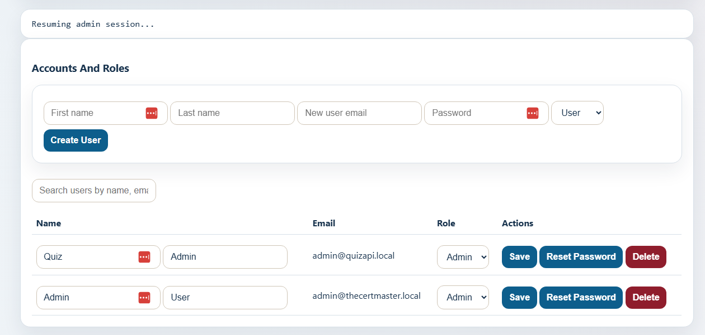
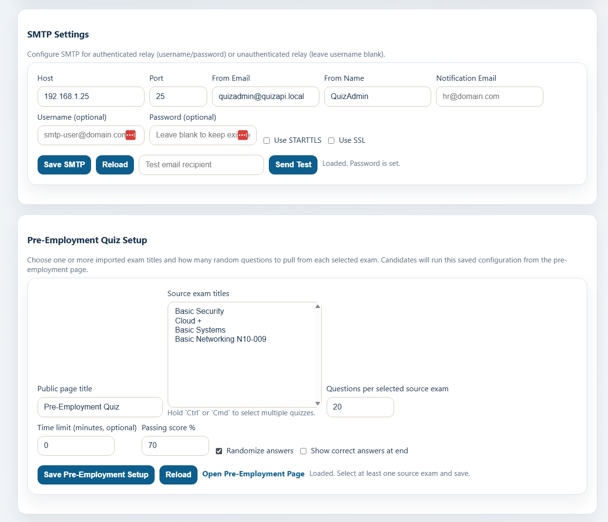
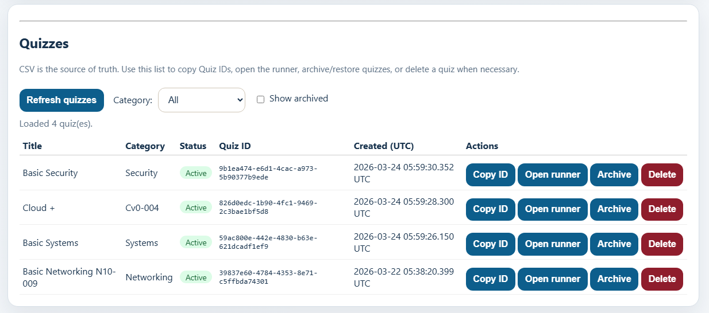
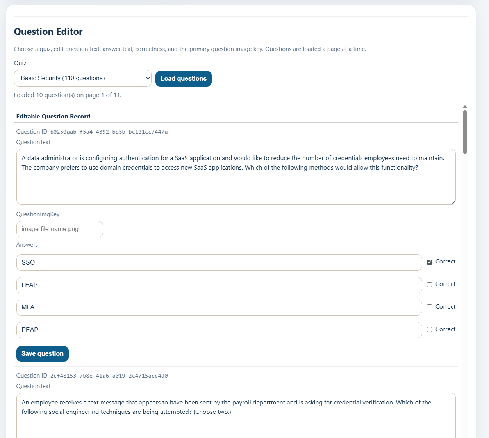
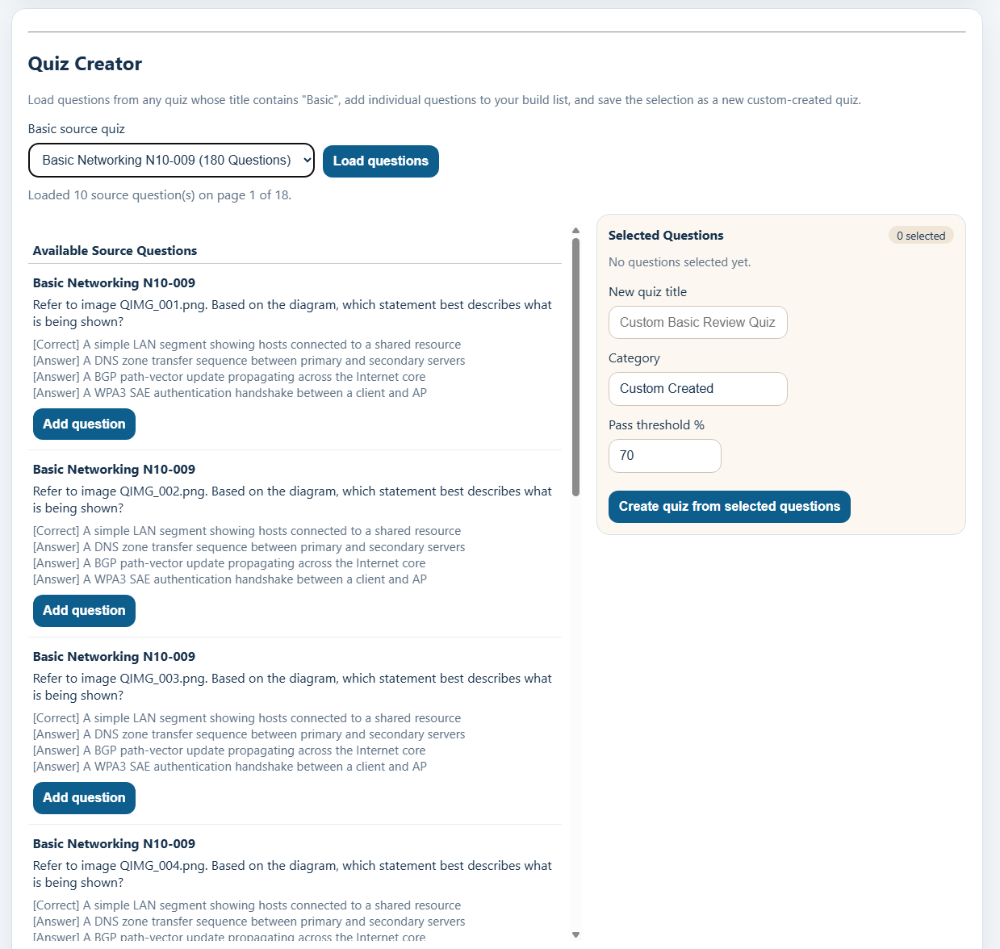
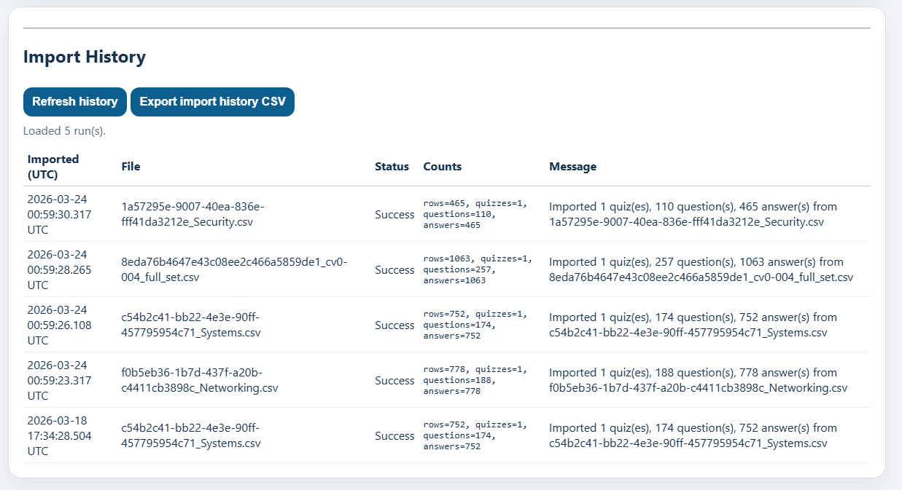
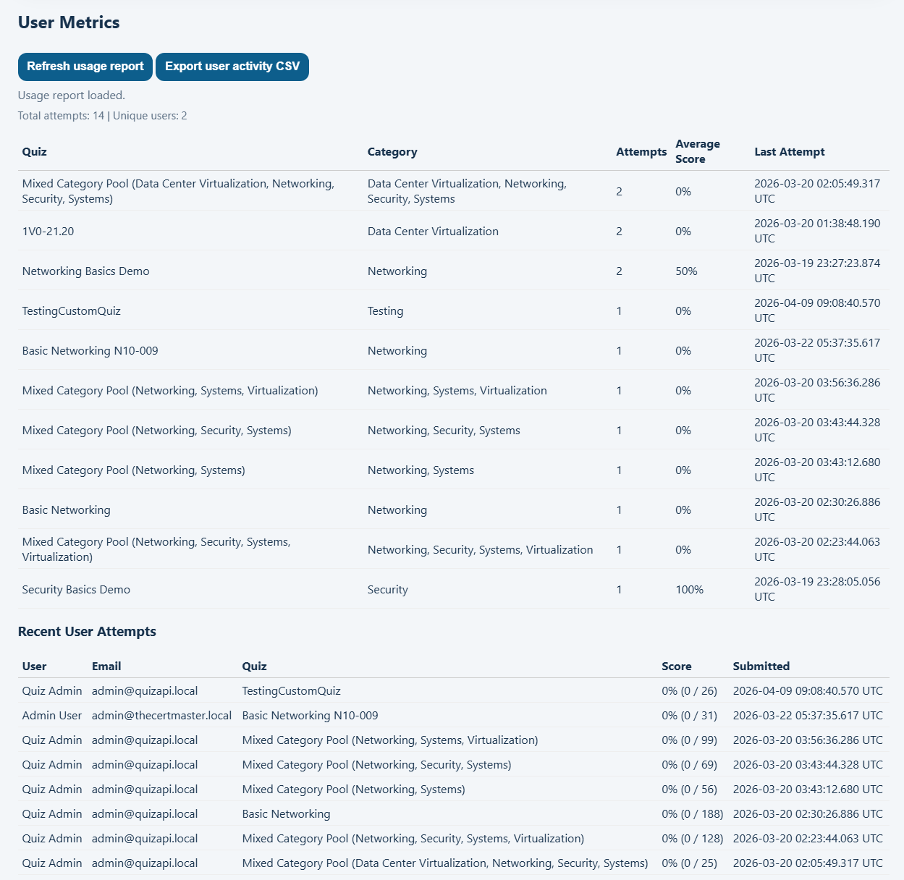
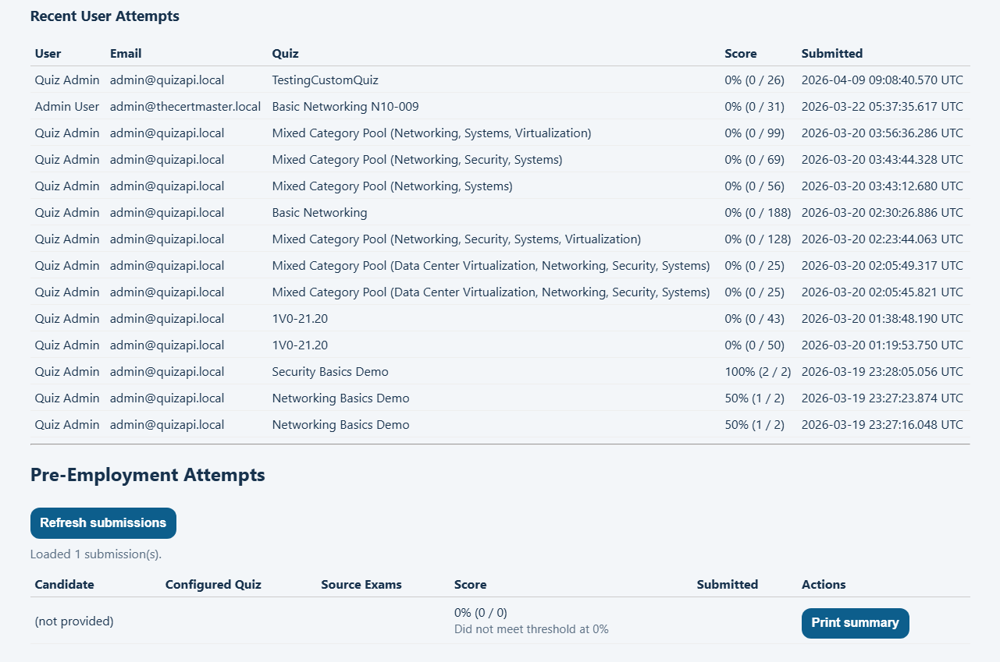

# TheCertMaster-CustomQuizs


TheCertMaster-CustomQuizs is a .NET 9 quiz platform for building, importing, managing, and delivering custom quizzes through a single ASP.NET Core application. It combines a JSON API, browser-based pages, admin tooling, question editing, custom quiz creation, reporting, and a pre-employment assessment flow in one deployable site.

## Overview

This project is the active source code for the corporate/custom-quiz version of TheCertMaster. It is designed to run as a single IIS-friendly application where the public site, user pages, admin pages, and API all live together.

It supports:

- user registration, login, profile management, and quiz history
- quiz launch, mixed quiz generation, scoring, and reporting
- quiz imports with uploaded media
- admin-side question editing with pagination
- custom quiz creation from selected questions in "Basic" quizzes
- pre-employment assessment configuration, generation, submissions, and notifications

## Screenshots

### Management Gallery



















## Features

- Serve the landing page from `/` and public utility pages from `wwwroot`
- Register users and authenticate with JWT-backed API flows
- Import quiz packages and uploaded images
- Edit existing questions directly from the management panel
- Build new custom quizzes from selected source questions
- Run pre-employment assessments with configurable quiz selection and question counts
- Access Swagger/OpenAPI during development

## Main Pages

- `/` for the landing page
- `/register.html` for registration
- `/user.html` for sign-in and profile access
- `/manage.html` for the management panel
- `/quiz.html` for quiz taking
- `/preemployment.html` for candidate assessments
- `/api.html` for API and developer links

## Tech Stack

- ASP.NET Core 9
- Entity Framework Core 9
- SQL Server
- ASP.NET Identity
- JWT authentication
- Swagger / OpenAPI
- Static HTML, CSS, and JavaScript under `wwwroot`

## System Requirements

### Minimum Hardware

These are practical minimums for a small internal deployment or evaluation server:

- CPU: 2 cores
- Memory: 8 GB RAM
- Drive: 80 GB SSD
- Network: 1 Gbps LAN or standard business internet connectivity

Recommended for a more comfortable production footprint:

- CPU: 4 cores or better
- Memory: 16 GB RAM
- Drive: 150 GB+ SSD with room for database growth, uploads, logs, and backups

### Operating System

Supported and recommended host environments:

- Windows Server 2019
- Windows Server 2022 or newer

Also workable for development or small internal evaluation:

- Windows 11 Pro

### Database

Required:

- Microsoft SQL Server 2019 or newer

Supported common choices:

- SQL Server Express for development or light internal use
- SQL Server Standard for production-style deployment

### Web Server

Required for IIS hosting:

- IIS 10 or newer
- ASP.NET Core Hosting Bundle for .NET 9 installed on the server

### Application Runtime

Required:

- .NET 9 runtime

Development machine requirement:

- .NET 9 SDK

## Installation Prerequisites

Before bringing the application online, the target server should have:

- Windows fully patched
- IIS installed
- ASP.NET Core Hosting Bundle installed
- SQL Server installed and reachable
- a SQL login strategy decided:
  - Windows integrated auth, or
  - SQL authentication
- a folder path prepared for the deployed site
- TLS certificate ready if the site will be served over HTTPS
- firewall rules opened for HTTP and HTTPS as needed

## Application Requirements

The app requires all of the following to start successfully:

- a valid SQL Server connection string
- `Jwt:Issuer`
- `Jwt:Audience`
- `Jwt:Key`

Important:

- `Jwt:Key` must be at least 32 characters long
- the application persists Data Protection keys under `App_Data/keys`
- uploaded files and image assets are stored under `wwwroot/uploads`
- production deployments should preserve `App_Data` and uploads across redeployments

## Bare-Bones Server Build Guide

This is the shortest path to a working server for this repository.

### Automated Bring-Up

For a bare Windows Server 2019 machine, the fastest path is the bootstrap script:

```powershell
powershell -ExecutionPolicy Bypass -File .\scripts\Bootstrap-Windows2019-QuizServer.ps1 `
  -HostName "quiz.yourdomain.example" `
  -Protocol "https" `
  -Port 443 `
  -CertificateThumbprint "YOUR_CERT_THUMBPRINT"
```

The bootstrap script can:

- install IIS and required Windows features
- download and install the current .NET 9 SDK
- download and install the current .NET 9 ASP.NET Core Hosting Bundle
- download and install SQL Server 2019 Express
- download the GitHub repo source zip
- apply EF Core migrations to create or update the target database
- build, test, publish, and package the app
- deploy the published app into IIS using the existing deployment script
- auto-generate a strong JWT key if `-JwtKey` is omitted
- write a full PowerShell transcript log under `C:\Deploy\logs`
- generate a post-install Markdown report with the detected IIS, SQL, and .NET state

If you want a plain HTTP first-pass install before TLS is ready:

```powershell
powershell -ExecutionPolicy Bypass -File .\scripts\Bootstrap-Windows2019-QuizServer.ps1 `
  -Protocol "http" `
  -Port 80
```

Important:

- this automation is written for Windows PowerShell 5.1 and should be run with `powershell.exe`
- run the bootstrap script from an elevated PowerShell session
- if SQL Express, IIS, the SDK, or the Hosting Bundle already exist, the script will skip reinstalling them
- the SQL Express download URL is parameterized and can be overridden if your environment mirrors installers internally
- use `-SaveGeneratedJwtKey` if you want the bootstrap to keep a recovery copy of an auto-generated JWT key with restricted local ACLs
- production secrets should still come from secure deployment inputs, not from source control

### 1. Prepare Windows

Install:

- Windows Server 2019 or newer
- latest Windows updates

Install IIS features:

- Web Server
- Static Content
- Default Document
- Request Filtering
- ASP.NET 4.x features are not required for the app itself, but are commonly present on Windows servers
- Management Console

### 2. Install .NET Hosting Support

Install on the server:

- .NET 9 ASP.NET Core Hosting Bundle
- .NET 9 SDK if you plan to build or publish on the server

This is what allows IIS to host the published ASP.NET Core app.

### 3. Install or Provision SQL Server

Create or provide:

- a SQL Server instance
- a database for the application
- an account with permission to read, write, and update schema when needed

Current local example:

```json
"ConnectionStrings": {
  "DefaultConnection": "Server=.\\SQLEXPRESS;Database=DevQuizDB;Trusted_Connection=True;TrustServerCertificate=True;MultipleActiveResultSets=True;"
}
```

For production, replace that with the real server and database name.

### 4. Clone or Copy the Repository

On the server or deployment workstation:

```powershell
git clone https://github.com/AIAllTheThingz/TheCertMaster-CustomQuizs.git
cd TheCertMaster-CustomQuizs
```

### 5. Configure Application Settings

At minimum, configure:

- `ConnectionStrings:DefaultConnection`
- `Jwt:Issuer`
- `Jwt:Audience`
- `Jwt:Key`
- `Cors:AllowedOrigins`

Recommended production approach:

- keep `appsettings.json` for shared defaults
- use environment-specific settings or environment variables for secrets
- do not commit production secrets into source control

Example JWT block:

```json
"Jwt": {
  "Issuer": "QuizAPI",
  "Audience": "QuizAPIUsers",
  "Key": "replace-with-a-real-32-plus-character-secret-key"
}
```

Environment variable equivalents:

```powershell
$env:ConnectionStrings__DefaultConnection="Server=SERVERNAME;Database=QuizDB;Trusted_Connection=True;TrustServerCertificate=True;MultipleActiveResultSets=True;"
$env:Jwt__Issuer="QuizAPI"
$env:Jwt__Audience="QuizAPIUsers"
$env:Jwt__Key="replace-with-a-real-32-plus-character-secret-key"
```

### 6. Build and Validate

```powershell
dotnet restore
dotnet build QuizAPI.sln -c Release
dotnet test QuizAPI.sln -c Release
```

### 7. Publish the Application

```powershell
dotnet publish QuizAPI.csproj -c Release -o .\publish
```

Or build the IIS deployment bundle:

```powershell
powershell -ExecutionPolicy Bypass -File .\scripts\Publish-IISPackage.ps1
```

### 8. Create the IIS Site

In IIS:

- create an application pool:
  - `No Managed Code`
- create a site pointing to the published folder
- bind the site to the desired hostname and port
- assign the correct TLS certificate if using HTTPS

The IIS app pool identity must be able to:

- read the site folder
- write to `App_Data`
- write to `wwwroot/uploads`

### 9. Start the Site

After deployment:

- browse to the site root
- confirm `/` loads
- confirm `/manage.html` loads
- confirm login works
- confirm quizzes and uploads are accessible

## Quick Start

### For Developers

1. Install the .NET 9 SDK.
2. Make sure SQL Server or SQL Server Express is available.
3. Configure the database connection and JWT settings.
4. Restore, build, and run the app.

```powershell
dotnet restore
dotnet build QuizAPI.sln
dotnet run
```

By default, the app runs on:

- `http://localhost:5085`
- `http://127.0.0.1:5085`

### For Reviewers or Non-Developers

If you just want to inspect the app locally:

1. Start the application with `dotnet run`.
2. Open `http://localhost:5085`.
3. Use the top navigation to move between registration, user access, management, quiz taking, and pre-employment pages.

## Configuration

The app requires:

- a SQL Server connection string
- JWT settings with a signing key of at least 32 characters
- CORS origins outside Development for non-local hosting

Common keys:

- `ConnectionStrings:DefaultConnection`
- `Jwt:Issuer`
- `Jwt:Audience`
- `Jwt:Key`
- `Database:AutoMigrateOnStartup`

In the current local setup:

- `appsettings.json` contains the SQL Server connection string
- `appsettings.Development.json` contains local development JWT settings and dev-only behavior

## IIS Deployment Notes

- The app is designed to be served from the root of a site, for example `https://fqdn.com/`
- For automated provisioning on Windows Server 2019, use `scripts/Bootstrap-Windows2019-QuizServer.ps1`
- Main pages are served directly from the same application:
  - `/`
  - `/register.html`
  - `/user.html`
  - `/manage.html`
  - `/quiz.html`
  - `/preemployment.html`
- `App_Data/keys` stores Data Protection keys so auth behavior survives app restarts and IIS recycles
- if you are moving environments, preserve any needed uploaded content under `wwwroot/uploads`
- if you are using an existing database, verify schema and migration history carefully before enabling auto-migration

## Testing

Run the automated tests with:

```powershell
dotnet test QuizAPI.sln -c Release
```

The test suite covers key flows such as imports, mixed quiz generation, pre-employment configuration and submissions, and admin editing workflows.

## Repository Layout

```text
Controllers/        API and admin endpoints
Data/               EF Core DbContext and database access
DTO/                Request and response models
Documentation/      Usage docs and README screenshots
Middleware/         Custom middleware such as audit logging
Migrations/         EF Core migrations
Models/             Domain and persistence models
Services/           Quiz query, import, email, and config services
wwwroot/            Static pages, scripts, styles, and uploaded assets
QuizAPI.Tests/      Integration and end-to-end flow tests
```

## Important Notes

- API JSON is serialized with PascalCase.
- Development auto-migration is disabled in the current local setup to avoid schema drift against existing databases.
- Uploaded content and operational files live inside the app structure, including `wwwroot/uploads` and `App_Data`.

## Documentation

- `Documentation/Application_Usage_Guide.md`

## Project Status

This repository is actively maintained and currently serves as the main source project for the corporate/custom quiz variant of TheCertMaster.
